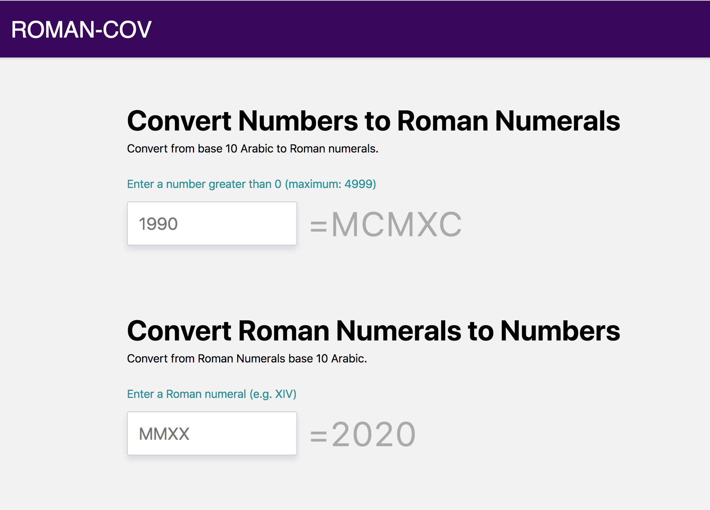

## ROMAN-COV

Modern Roman numerals Converter

---

Modern Roman numerals are written by expressing each digit separately starting with the left most digit and skipping any digit with a value of zero. For example, in Roman numerals 1990 is rendered: 1000=M, 900=CM, 90=XC; resulting in MCMXC. 2008 is written as 2000=MM, 8=VIII; or MMVIII.

---

<div align="center">
  <br>
</div>

---

## Getting Started

First, run the development server:

```bash
npm run dev
# or
yarn dev
```

Open [http://localhost:3000](http://localhost:3000) with your browser to see the result.

You can start editing the page by modifying `pages/index.js`. The page auto-updates as you edit the file.
